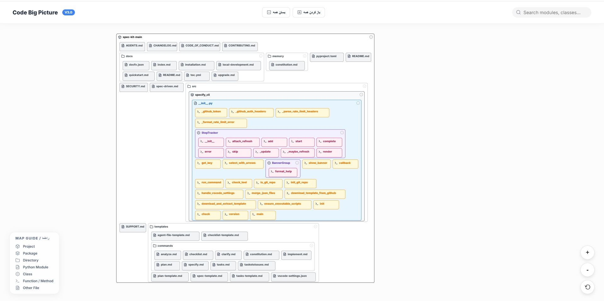

<div align="center" dir="rtl">

# 🏗️ تصویر بزرگ کد

**کدبیس پایتون خود را به یک نقشه بصری تعاملی و زیبا تبدیل کنید.**

[](https://github.com/hamid-morsali-786/code-big-picture)
[](https://python.org)
[](LICENSE)

---

*کل کدبیس خود را یک‌نگاه ببینید. پیمایش کنید، جستجو کنید و ساختارهای پیچیده پروژه را فوراً درک کنید.*

[🇬🇧 English Version](README.md)

</div>

---

## ✨ ویژگی‌ها

| ویژگی | توضیحات |
|-------|---------|
| 🎨 **رابط کاربری مدرن** | طراحی Glassmorphism با انیمیشن‌های روان |
| 🔍 **جستجوی هوشمند** | جستجوی لحظه‌ای با هایلایت هوشمند |
| 🌳 **نمای سلسله‌مراتبی** | باکس‌های تودرتو برای پکیج‌ها، ماژول‌ها، کلاس‌ها و توابع |
| 📐 **چیدمان داینامیک** | الگوریتم کاشی‌کاری هوشمند برای استفاده بهینه از فضا |
| 🔄 **باز/بسته شدن تعاملی** | باز و بسته کردن هر نود با ری‌لاوت هوشمند |
| 🎯 **پن و زوم** | بزرگنمایی بی‌نهایت با پیمایش روان |
| 📱 **آیکون‌ها** | آیکون‌های SVG برای تشخیص فوری نوع نود |
| 🗺️ **راهنمای نقشه** | راهنمای داخلی برای درک بصری‌سازی |

---

## 🎬 نمایش



---

## 🚀 شروع سریع

### نصب

```bash
# کلون کردن مخزن
git clone https://github.com/hamid-morsali-786/code-big-picture.git
cd code-big-picture

# بدون نیاز به هیچ کتابخانه‌ای! پایتون خالص.
```

### استفاده

```bash
# تولید visualization برای هر پروژه پایتون
python main.py /path/to/your/project -o output.html

# مثال
python main.py ./my-awesome-project -o my-project-map.html
```

سپس `output.html` را در مرورگر باز کنید! 🎉

---

## 🛠️ نحوه کار

```
پروژه پایتون ──► پارسر AST ──► درخت ساختار ──► رندرر SVG ──► HTML تعاملی
```

1. **پارس** - فایل‌های پایتون را با استفاده از AST (درخت نحو انتزاعی) تحلیل می‌کند
2. **ساختاربندی** - درخت سلسله‌مراتبی از پکیج‌ها، ماژول‌ها، کلاس‌ها و توابع می‌سازد
3. **رندر** - SVG بهینه با چیدمان کاشی‌کاری هوشمند تولید می‌کند
4. **تعامل** - یک فایل HTML با قابلیت پن، زوم، جستجو و باز/بسته شدن خروجی می‌دهد

---

## 📁 ساختار پروژه

```
code-big-picture/
├── main.py              # نقطه ورود CLI
├── code_big_picture/
│   ├── parser.py        # تحلیلگر کد پایتون
│   └── renderer.py      # تولیدکننده SVG/HTML (موتور V3.0)
└── sample_project/      # پروژه نمونه برای تست
```

---

## 🎨 انواع نود

| آیکون | نوع | رنگ |
|-------|-----|-----|
| 🏠 | پروژه | سفید |
| 📦 | پکیج | خاکستری روشن |
| 📁 | دایرکتوری | سفید |
| 📄 | ماژول (.py) | آبی روشن |
| 🔷 | کلاس | بنفش روشن |
| ⚡ | تابع/متد | زرد/صورتی |
| 📝 | سایر فایل‌ها | خاکستری |

---

## ⌨️ کنترل‌ها

| عملیات | کنترل |
|--------|-------|
| **پن (جابجایی)** | کلیک + درگ |
| **زوم** | چرخ موس / دکمه‌های +/- |
| **جستجو** | تایپ در باکس جستجو |
| **باز/بسته کردن** | کلیک روی دکمه toggle هر نود |
| **بستن همه** | کلیک روی دکمه "بستن همه" |
| **باز کردن همه** | کلیک روی دکمه "باز کردن همه" |
| **تناسب با صفحه** | کلیک روی دکمه ⟲ |

---

## 🔧 موتور نسخه 3.0

آخرین نسخه دارای **موتور محاسبه ارتفاع داینامیک** کاملاً بازنویسی شده است:

- ✅ **بدون فضای خالی** - ارتفاع‌ها بر اساس محتوای واقعی قابل مشاهده محاسبه می‌شوند
- ✅ **باز شدن مرحله‌ای** - باز کردن دستی نودها بدون مشکل کار می‌کند
- ✅ **انتشار پایین به بالا** - نودهای والد هنگام تغییر فرزندان خودکار تغییر اندازه می‌دهند
- ✅ **جابجایی هوشمند ردیف‌ها** - ردیف‌ها موقعیت خود را در لحظه بازمحاسبه می‌کنند

---

## 🤝 مشارکت

مشارکت‌ها خوش‌آمدند! می‌توانید:

1. مخزن را Fork کنید
2. یک شاخه ویژگی بسازید (`git checkout -b feature/amazing-feature`)
3. تغییرات خود را Commit کنید (`git commit -m 'Add amazing feature'`)
4. به شاخه Push کنید (`git push origin feature/amazing-feature`)
5. یک Pull Request باز کنید

---

## 📄 لایسنس

این پروژه تحت لایسنس MIT منتشر شده است - فایل [LICENSE](LICENSE) را ببینید.

---

<div align="center">

**ساخته شده با 💎 توسط [حمید مرسلی](https://github.com/hamid-morsali-786)**

</div>
