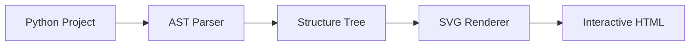

<div align="center">

# 🏗️ Code Big Picture

**Transform your Python codebase into a stunning, interactive visual map.**

[](https://github.com/hamid-morsali-786/code-big-picture)
[](https://python.org)
[](LICENSE)


---

*See your entire codebase at a glance. Navigate, search, and understand complex project structures instantly.*

</div>

## ✨ Features

| Feature | Description |
|---------|-------------|
| 🎨 **Modern UI** | Glassmorphism design with smooth animations |
| 🔍 **Smart Search** | Real-time search with context-aware highlighting |
| 🌳 **Hierarchical View** | Nested boxes showing packages, modules, classes, and functions |
| 📐 **Dynamic Layout** | Intelligent tiling algorithm for optimal space usage |
| 🔄 **Interactive Collapse** | Expand/collapse any node with smart reflow |
| 🎯 **Pan & Zoom** | Infinite zoom with smooth navigation |
| 📱 **Icons** | SVG icons for instant node type recognition |
| 🗺️ **Map Legend** | Built-in guide for understanding the visualization |

## 🎬 Demo

### Full Project View
The entire codebase rendered as an interactive, navigable map:


## 🚀 Quick Start

### Installation

```bash
# Clone the repository
git clone https://github.com/hamid-morsali-786/code-big-picture.git
cd code-big-picture

# No dependencies required! Pure Python.
```

### Usage

```bash
# Generate visualization for any Python project
python main.py /path/to/your/project -o output.html

# Example
python main.py ./my-awesome-project -o my-project-map.html
```

Then open `output.html` in your browser! 🎉

## 🛠️ How It Works



1. **Parse** - Analyzes your Python files using AST (Abstract Syntax Tree)
2. **Structure** - Builds a hierarchical tree of packages, modules, classes, and functions
3. **Render** - Generates optimized SVG with smart tiling layout
4. **Interact** - Outputs a single HTML file with pan, zoom, search, and collapse features

## 📁 Project Structure

```
code-big-picture/
├── main.py              # CLI entry point
├── code_big_picture/
│   ├── parser.py        # Python code analyzer
│   └── renderer.py      # SVG/HTML generator (V3.0 Engine)
└── sample_project/      # Example project for testing
```

## 🎨 Node Types

| Icon | Type | Color |
|------|------|-------|
| 🏠 | Project | White |
| 📦 | Package | Light Gray |
| 📁 | Directory | White |
| 📄 | Module (.py) | Light Blue |
| 🔷 | Class | Light Purple |
| ⚡ | Function/Method | Yellow/Pink |
| 📝 | Other File | Gray |

## ⌨️ Controls

| Action | Control |
|--------|---------|
| **Pan** | Click + Drag |
| **Zoom** | Mouse Wheel / +/- buttons |
| **Search** | Type in search box |
| **Collapse/Expand** | Click the toggle button on any node |
| **Collapse All** | Click "بستن همه" button |
| **Expand All** | Click "باز کردن همه" button |
| **Fit to Screen** | Click ⟲ button |

## 🔧 V3.0 Engine

The latest version features a completely rewritten **Dynamic Height Calculation Engine**:

- ✅ **No more empty spaces** - Heights are calculated dynamically based on actual visible content
- ✅ **Step-by-step expansion** - Manual node expansion works flawlessly
- ✅ **Bottom-up propagation** - Parent nodes automatically resize when children change
- ✅ **Smart row repositioning** - Rows recalculate positions in real-time

## 🤝 Contributing

Contributions are welcome! Feel free to:

1. Fork the repository
2. Create a feature branch (`git checkout -b feature/amazing-feature`)
3. Commit your changes (`git commit -m 'Add amazing feature'`)
4. Push to the branch (`git push origin feature/amazing-feature`)
5. Open a Pull Request

## 📄 License

This project is licensed under the MIT License - see the [LICENSE](LICENSE) file for details.

## 🙏 Acknowledgments

- Built with ❤️ using Python
- Pan/Zoom powered by [Panzoom](https://github.com/timmywil/panzoom)
- Icons inspired by [Feather Icons](https://feathericons.com/)

---

<div align="center">

**[⬆ Back to Top](#-code-big-picture)**

Made with 💎 by [Hamid Morsali](https://github.com/hamid-morsali-786)

</div>
